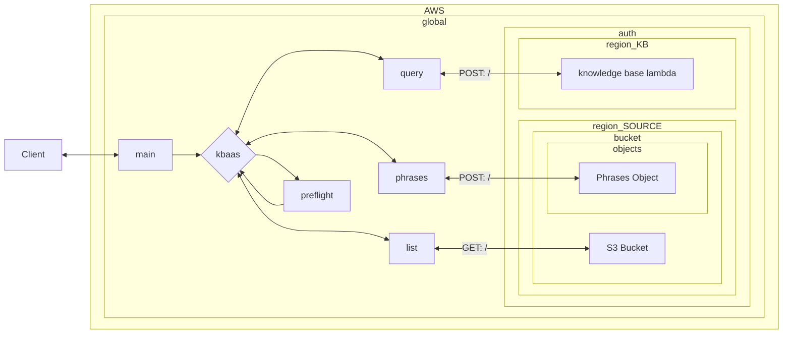

```mermaid
    flowchart LR

    Client <--> STAGE
    
    subgraph AWS
    subgraph global

        STAGE[main]
        KBAAS{kbaas}

        PREFLIGHT[preflight]
        
        STAGE --> KBAAS
        
        KBAAS --> PREFLIGHT
        PREFLIGHT --> KBAAS

        KBAAS <--> LIST & PHRASES & QUERY

        LIST[list]
        PHRASES[phrases]
        QUERY[query]

        PREFLIGHT ~~~ LIST & PHRASES & QUERY 

        LIST <-- GET: / --> BUCKET
        PHRASES <-- POST: / --> OBJECT
        QUERY <-- POST: / --> KB_LAMBDA

        subgraph auth
            subgraph region_SOURCE
                subgraph bucket
                    BUCKET[S3 Bucket]
                    subgraph objects
                        OBJECT[Phrases Object]
                    end
                end
            end

            subgraph region_KB
                KB_LAMBDA[knowledge base lambda]
            end
        end
        end
    end
```
